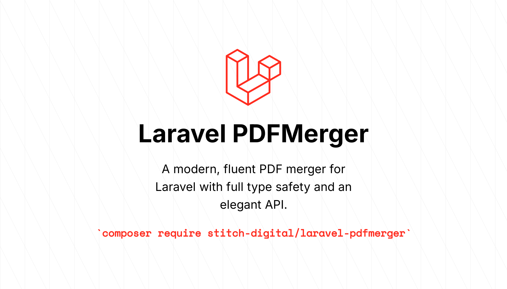

# Laravel PDFMerger

[](https://packagist.org/packages/stitch-digital/laravel-pdfmerger)
[](https://github.com/stitch-digital/laravel-pdfmerger/actions?query=workflow%3Atests+branch%3Amaster)
[](https://github.com/stitch-digital/laravel-pdfmerger/actions?query=workflow%3Acode-quality+branch%3Amaster)
[](https://packagist.org/packages/stitch-digital/laravel-pdfmerger)

A modern, fluent PDF merger for Laravel with full type safety and an elegant API. Merge multiple PDF files with ease using a developer-friendly interface.



## Features

- 🚀 **Modern PHP**: Built for PHP 8.2+ with strict types
- 🎯 **Fluent API**: Chainable methods following Laravel conventions
- 🔒 **Type Safe**: Full type hints and return types for better IDE support
- 🌐 **URL Support**: Add PDFs from both local paths and remote URLs
- 🎨 **Enum Support**: Use `Orientation` enum for better developer experience
- 🎨 **Laravel 10-11**: Compatible with Laravel 10 and 11
- 📦 **Auto-Discovery**: Zero configuration with Laravel package auto-discovery
- 🧪 **Fully Tested**: Comprehensive test suite with PHPUnit
- 📝 **Well Documented**: Clear examples and inline documentation

## Requirements

- PHP 8.2 or higher
- Laravel 10.0 or 11.0

## Installation

Install the package via Composer:

```bash
composer require stitch-digital/laravel-pdfmerger
```

The package will automatically register itself via Laravel's package discovery.

### Publish Configuration (Optional)

You can publish the configuration file if you want to customize default settings:

```bash
php artisan vendor:publish --tag=pdfmerger-config
```

## Usage

### Basic Example

```php
use StitchDigital\PDFMerger\Facades\PDFMergerFacade as PDFMerger;

PDFMerger::make()
    ->addPDF('/path/to/first.pdf')
    ->addPDF('/path/to/second.pdf')
    ->merge()
    ->save('merged_output.pdf');
```

### Fluent API with Method Chaining

```php
PDFMerger::make()
    ->addPDF('/path/to/file1.pdf', pages: [1, 2, 3])
    ->addPDF('/path/to/file2.pdf', pages: 'all')
    ->addPDF('/path/to/file3.pdf', pages: [1])
    ->merge()
    ->save('output.pdf');
```

### Selecting Specific Pages

```php
PDFMerger::make()
    ->addPDF($file, 'all')           // Add all pages
    ->addPDF($file, [1])             // Add page 1 only
    ->addPDF($file, [1, 3, 5])       // Add pages 1, 3, and 5
    ->merge()
    ->save();
```

### Using Named Parameters (PHP 8.0+)

```php
use StitchDigital\PDFMerger\Enums\Orientation;

PDFMerger::make()
    ->addPDF(
        filePath: '/path/to/file.pdf',
        pages: [1, 3, 5],
        orientation: Orientation::Landscape
    )
    ->merge()
    ->save('output.pdf');
```

### Setting Orientation

You can set orientation using strings or the `Orientation` enum for better IDE support and type safety:

```php
use StitchDigital\PDFMerger\Enums\Orientation;

// Using enum (recommended)
PDFMerger::make()
    ->orientation(Orientation::Landscape)
    ->addPDF($file1)
    ->addPDF($file2)
    ->merge()
    ->save();

// Using string (still supported)
PDFMerger::make()
    ->orientation('L')  // 'L' for Landscape, 'P' for Portrait
    ->addPDF($file1)
    ->addPDF($file2)
    ->merge()
    ->save();

// Per-file orientation
PDFMerger::make()
    ->addPDF($file1, pages: 'all', orientation: Orientation::Portrait)
    ->addPDF($file2, pages: 'all', orientation: Orientation::Landscape)
    ->merge()
    ->save();
```

### Duplex Printing Support

Add blank pages between documents to support double-sided printing:

```php
PDFMerger::make()
    ->duplex(true)
    ->addPDF($file1)
    ->addPDF($file2)
    ->merge()
    ->save();

// Or use duplexMerge directly
PDFMerger::make()
    ->addPDF($file1)
    ->addPDF($file2)
    ->duplexMerge()
    ->save();
```

### Working with String Content

```php
$pdfContent = file_get_contents('/path/to/file.pdf');

PDFMerger::make()
    ->addString($pdfContent, pages: [1, 2])
    ->merge()
    ->save();
```

### Using URLs (Remote PDFs)

The package can automatically download and merge PDFs from remote URLs:

```php
// Using remote URLs
PDFMerger::make()
    ->addPDF('https://example.com/document1.pdf')
    ->addPDF('https://example.com/document2.pdf')
    ->merge()
    ->save('merged.pdf');

// With Laravel's asset() helper
PDFMerger::make()
    ->addAll(asset('pdfs/document1.pdf'))
    ->addAll(asset('pdfs/document2.pdf'))
    ->merge()
    ->save('merged.pdf');

// Mix local and remote PDFs
PDFMerger::make()
    ->addPDF('/local/path/document.pdf')
    ->addPDF('https://example.com/remote-document.pdf')
    ->addPDF(public_path('pdfs/another.pdf'))
    ->merge()
    ->save();

// URLs support all the same options as local files
PDFMerger::make()
    ->addPDF('https://example.com/doc.pdf', pages: [1, 3, 5])
    ->addPDF('https://example.com/doc2.pdf', orientation: Orientation::Landscape)
    ->merge()
    ->save();
```

Downloaded PDFs are automatically stored in temporary files and cleaned up after the merge operation completes.

#### URL Security Configuration

URL downloads can be configured in `config/pdfmerger.php`:

```php
return [
    // Enable or disable URL downloads
    'allow_urls' => env('PDFMERGER_ALLOW_URLS', true),
    
    // Timeout for URL downloads (seconds)
    'url_download_timeout' => env('PDFMERGER_DOWNLOAD_TIMEOUT', 30),
    
    // Verify SSL certificates for HTTPS URLs
    'url_verify_ssl' => env('PDFMERGER_VERIFY_SSL', true),
];
```

**Automatic Local Development Support:**

SSL verification is **automatically disabled** when `APP_ENV=local`, making it work seamlessly with local domains like `.test`, `.local`, or self-signed certificates. No configuration needed!

**For production environments**, SSL verification is automatically enabled when `APP_ENV=production`, ensuring secure connections.

You can override this behavior in your `.env` if needed:

```env
PDFMERGER_VERIFY_SSL=false  # Force disable SSL verification
```

**Security Notes:**
- URL downloads are enabled by default but can be disabled via configuration
- SSL certificate verification is **automatically managed based on environment** (`local` vs `production`)
- SSL verification is **always disabled in local environments** for developer convenience
- SSL verification is **always enabled in production** for security (unless explicitly overridden)
- Downloaded files are stored in temporary storage and automatically cleaned up
- Consider disabling URL support (`allow_urls => false`) in security-sensitive environments
- Only use URLs from trusted sources to prevent potential security risks

### Output Methods

```php
$merger = PDFMerger::make()
    ->addPDF($file1)
    ->addPDF($file2)
    ->merge();

// Save to disk
$merger->save('output.pdf');
$merger->saveAs('output.pdf');  // Alias

// Download in browser
return $merger->download();

// Stream to browser
return $merger->stream();

// Get as Response object
return $merger->toResponse();

// Get raw PDF content
$content = $merger->output();

// Get as base64 encoded string
$base64 = $merger->toBase64();
```

### Method Aliases for Better Readability

```php
PDFMerger::make()
    ->add($file)           // Alias for addPDF()
    ->addFile($file)       // Alias for addPDF()
    ->addAll($file)        // Shorthand for addPDF($file, 'all')
    ->merge()
    ->save();
```

### Adding Multiple Files at Once

```php
$files = [
    ['path' => '/path/to/file1.pdf', 'pages' => [1, 2]],
    ['path' => '/path/to/file2.pdf', 'pages' => 'all'],
    ['path' => '/path/to/file3.pdf', 'pages' => [1]],
];

PDFMerger::make()
    ->addMany($files)
    ->merge()
    ->save();
```

### Conditional Operations

```php
$merger = PDFMerger::make()
    ->when($condition, fn($m) => $m->addPDF($file))
    ->unless($otherCondition, fn($m) => $m->duplex(true))
    ->merge();
```

### Using Tap for Side Effects

```php
PDFMerger::make()
    ->addPDF($file1)
    ->tap(fn() => logger('Added first file'))
    ->addPDF($file2)
    ->tap(fn() => logger('Added second file'))
    ->merge()
    ->save();
```

### Setting Custom Filename

```php
PDFMerger::make()
    ->setFileName('my-merged-document.pdf')
    ->addPDF($file1)
    ->addPDF($file2)
    ->merge()
    ->save();  // Will use 'my-merged-document.pdf' as filename
```

### Resetting the Merger

```php
$merger = PDFMerger::make()
    ->addPDF($file1)
    ->merge()
    ->save('first.pdf');

// Reset and reuse
$merger->reset()
    ->addPDF($file2)
    ->merge()
    ->save('second.pdf');
```

## Error Handling

The package throws specific exceptions for different error scenarios:

```php
use StitchDigital\PDFMerger\Exceptions\PDFNotFoundException;
use StitchDigital\PDFMerger\Exceptions\InvalidPagesException;
use StitchDigital\PDFMerger\Exceptions\PDFMergeException;

try {
    PDFMerger::make()
        ->addPDF('/path/to/file.pdf')
        ->merge()
        ->save();
} catch (PDFNotFoundException $e) {
    // File not found or URL download failed
    // Examples:
    // - "Could not locate PDF file at '/path/to/file.pdf'"
    // - "Could not download PDF from 'https://example.com/file.pdf': Connection timeout"
    // - "URL downloads are disabled in configuration"
} catch (InvalidPagesException $e) {
    // Invalid pages parameter
} catch (PDFMergeException $e) {
    // General merge error
}
```

## Configuration

The published configuration file (`config/pdfmerger.php`) allows you to customize:

- **temp_path**: Directory for temporary files
- **output_path**: Default output directory
- **orientation**: Default page orientation ('P' or 'L')
- **duplex**: Enable duplex mode by default
- **memory_limit**: Memory limit for large files (in MB)
- **allow_urls**: Enable/disable URL downloads (default: `true`)
- **url_download_timeout**: Timeout for URL downloads in seconds (default: `30`)
- **url_verify_ssl**: Verify SSL certificates for HTTPS URLs (default: `true`)
- **disk**: Default Storage disk for integration

## Extending with Macros

You can extend the package with custom methods using macros:

```php
use StitchDigital\PDFMerger\PDFMerger;

PDFMerger::macro('addDirectory', function ($directory) {
    foreach (glob($directory . '/*.pdf') as $file) {
        $this->addPDF($file);
    }
    return $this;
});

// Usage
PDFMerger::make()
    ->addDirectory('/path/to/pdfs')
    ->merge()
    ->save();
```

## Upgrading from v1.x

See [UPGRADING.md](UPGRADING.md) for detailed upgrade instructions.

### Key Breaking Changes

- Minimum PHP version is now 8.2
- Minimum Laravel version is now 9.0
- `init()` is deprecated, use `make()` instead
- `merge()` now returns `self` instead of `void` for chaining
- Hungarian notation removed from internal properties

## Testing

Run the test suite:

```bash
composer test
```

Run with coverage:

```bash
composer test-coverage
```

## Code Quality

Check code style:

```bash
composer format-check
```

Fix code style:

```bash
composer format
```

Run static analysis:

```bash
composer analyse
```

## Changelog

Please see [CHANGELOG](CHANGELOG.md) for more information on what has changed recently.

## Contributing

Please see [CONTRIBUTING](CONTRIBUTING.md) for details.

## Security Vulnerabilities

Please review our [security policy](SECURITY.md) on how to report security vulnerabilities.

## Credits

- [Stitch Digital](https://github.com/stitch-digital) - Current Maintainer
- [Webklex](https://github.com/webklex) - Original Author
- [All Contributors](../../contributors)

## License

The MIT License (MIT). Please see [License File](LICENSE.md) for more information.
